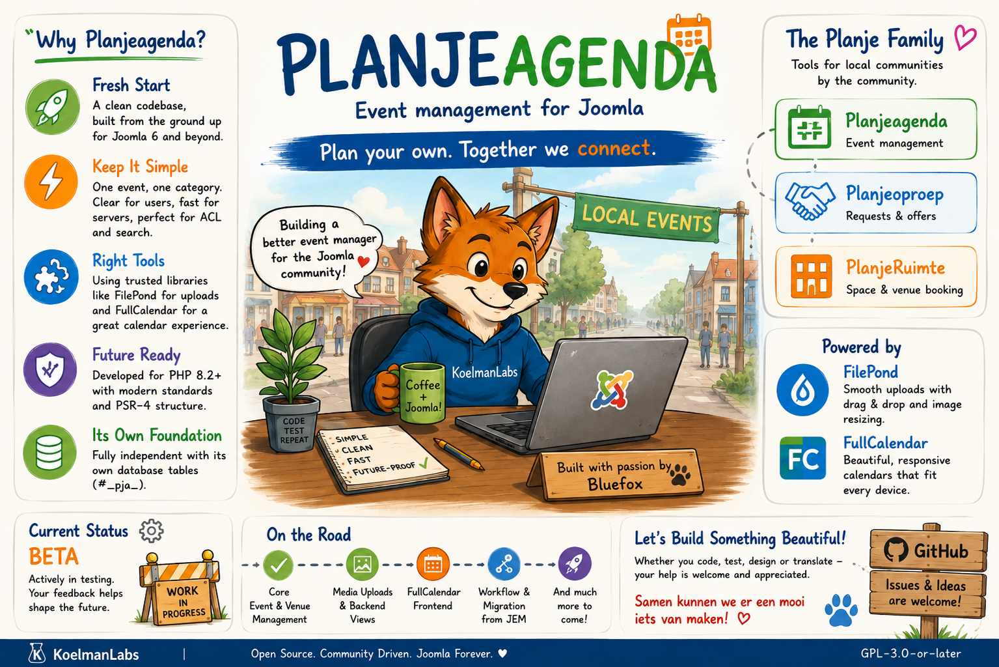

# Planjeagenda
### Event manager for Joomla

  

**Planjeagenda** is an event management extension for Joomla, built from the ground up as a fresh approach to handling events, venues, and scheduling.

It is developed under **KoelmanLabs**, as part of my ongoing work on tools for community-driven websites.

---

## 🎯 Goal

The goal is simple: build an event manager for Joomla that feels clear, reliable, and easy to work with.

Planjeagenda focuses on keeping things understandable — for both developers and site administrators — without unnecessary complexity.

---

## 📖 Why I Started This Project

After many years working on **Joomla Event Manager (JEM)**, I reached a point where parts of the existing codebase and older architectural decisions were making experimentation and further development increasingly difficult.

Planjeagenda is my way of starting fresh.

Not to replace what already exists, but to explore what happens when you rebuild an event system with today’s understanding of Joomla development — keeping what works, and rethinking what doesn’t.

---

## 🌍 The Planje Idea

The name **Planje** comes from the Dutch phrase:

> **"Plan je eigen"** — *Plan your own*

It reflects a simple idea:
give people and communities the tools to organize their own activities and events.

### The Planje Ecosystem
Planjeagenda is currently the only active project within the broader **Planje** idea.

Other concepts may follow later, including:
- **Planjeoproep** → local requests & offers
- **PlanjeRuimte** → space and venue booking

At the moment, these are still ideas and are not yet in active development.

---

## 🛠️ How It’s Built

### 🗂️ Custom Category Structure
Planjeagenda uses its own category structure designed specifically for event management.

This keeps things:
- straightforward to manage,
- predictable in behavior,
- and focused on real event use cases.

The project intentionally uses a **single-category approach** to keep the structure simpler and easier to maintain.

---

### 📅 Calendar Integration
The frontend calendar is being built around **FullCalendar**.

This provides:
- responsive calendar views,
- smooth interaction on mobile and desktop,
- and flexible event rendering.

---

### 🖼️ Image Uploads
Backend media handling uses **FilePond**.

Features include:
- drag-and-drop uploads,
- client-side image resizing,
- and a cleaner editing experience for administrators.

---

### ⚙️ Technical Foundation
- PHP 8.2+
- Joomla 6+
- PSR-4 structure
- MVC architecture
- Separate database tables (`#__pja_`)

---

## 🧪 Current Status — Beta

Planjeagenda is still in an early stage of development.

At the moment, development mainly happens locally while the basic structure and core functionality are being stabilized.

### ✅ Already Working
- Backend event management
- Backend Venue management
- File uploads with FilePond
- Initial administrator views
- Basic component structure

### 🚧 Currently In Progress
- Frontend calendar integration with FullCalendar
- Workflow integration
- Migration path from JEM
- Improved frontend output and layouts

---

## 🎯 Intended Use Cases

Planjeagenda is mainly meant for:
- local communities
- sports clubs
- cultural organisations
- municipalities
- volunteer groups
- Joomla site builders

---

## 🗺️ Roadmap

### Early Stage
- Core event system
- Venue handling
- Backend stability

### Next Step
- Frontend calendar experience
- Workflow integration
- Migration tools

### Later
- API possibilities
- Recurring events
- Extended filtering

---

## 🤝 Contributing

Planjeagenda is a personal open-source project built under KoelmanLabs.

I’m not a large company or a full development team — just someone passionate about Joomla and trying to build something useful for the community.

A lot of this project is learning, experimenting, improving, and building step by step. With help, feedback, and contributions from others, I truly believe this can grow into something special.

Whether you:
- write code,
- test features,
- improve styling,
- help with translations,
- report bugs,
- or simply share ideas,

your help is genuinely appreciated.

> *Samen kunnen we er iets moois van maken.*

---

## 🔗 Links

- Website: https://koelmanlabs.com
- Issues & ideas: GitHub Issues

---

## 📄 License

GPL-3.0-or-later

---

*Built with persistence and passion for Joomla by Bluefox.*

## 📸 Screenshots

Screenshots and interface previews will be added as the project evolves.
